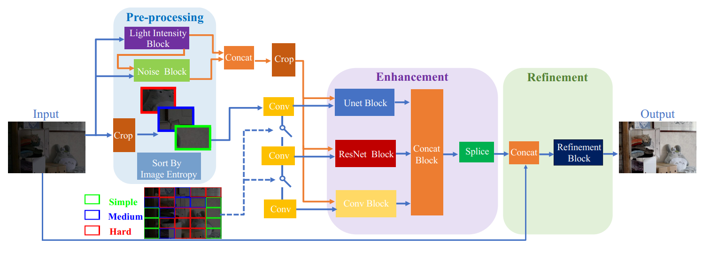

#A LIGHTWEIGHT IMAGE ENTROPY-BASED DIVIDE-AND-CONQUER NETWORK FOR LOW-LIGHT IMAGE ENHANCEMENT(IEDCN)
This is the official Pytorch implementation for this paper.
## Introduction
Images captured in low-light conditions usually suffer from degradation problems. Based on the observation, we found
that different image regions have different enhancement difficulties and can be processed by networks with different
capacities. Hence, in this work, we propose a lightweight image entropy-based divide-and-conquer network called IEDCN for low-light image enhancement.



## Requirement
- cuda & cudnn
- python==3.6
- torch==1.5.1
- torchvision==0.6.1
- Pillow
- tqdm

## Citation
If you find our work useful in your research or publications, please consider citing:
```
@inproceedings{wu2022lightweight,
  title={A Lightweight Image Entropy-Based Divide-and-Conquer Network for Low-Light Image Enhancement},
  author={Wu, Hongjun and Qi, Haoran and Luo, Jingzhou and Li, Yining and Jin, Zhi},
  booktitle={2022 IEEE International Conference on Multimedia and Expo (ICME)},
  year={2022},
}
```